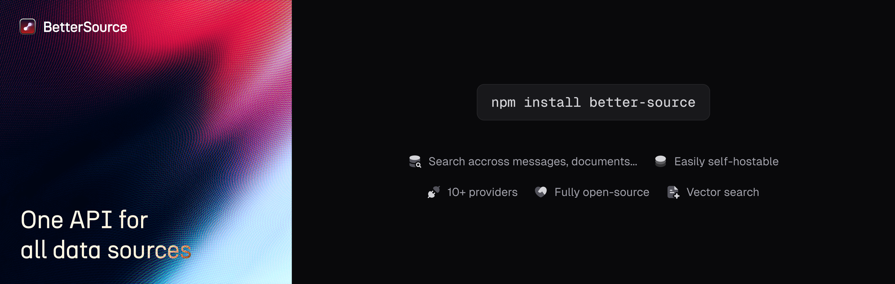

  <picture>
    
  </picture>
  

    <h1>Better Source</h1>
    

        <a>One API for all data sources</a>
        ·
        <a href="https://discord.gg/better-source">Discord</a>
        ·
        <a href="https://bettersource.dev">Website</a>
        ·
        <a href="https://github.com/utopyin/better-source/issues">Issues</a>
    

    

        
        
        
    

  

